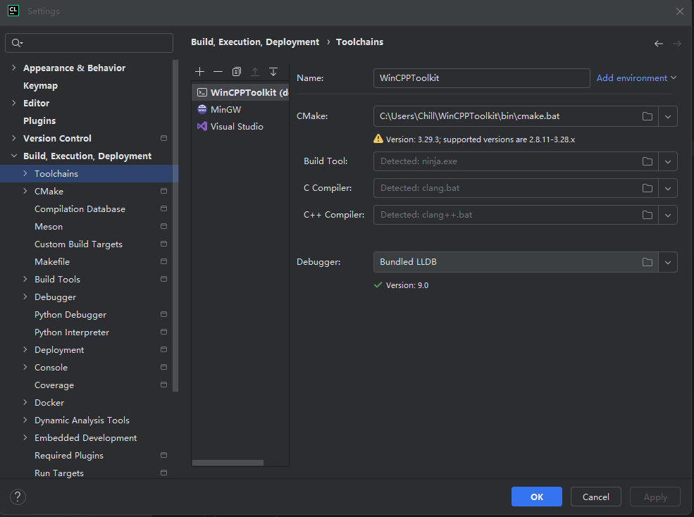

# WinCPPToolkit

WinCPPToolkit is an integrated suite of popular C++ build tools for Windows, designed to enhance the efficiency of cross-platform projects being developed within the Windows environment.

You can use it on Windows in a way similar to Linux like this:
```
mkdir build
cd build
cmake ..
ninja
```

Currently integrated or in the process of integration tools:
- clang+llvm
- cmake
- ninja
- git

## Requirements
- Windows 10 or later
- Python 3 (Optional)

## Setup

To setup this tool, you typically follow these steps after ensuring Python is installed on your system:

1. **Clone the repository**:
   Clone the repository to your local machine using Git.
   ```bash
   git clone https://github.com/ChillMagic/WinCPPToolkit.git
   ```

2. **Navigate to the project directory**:
   Change into the project directory.
   ```bash
   cd WinCPPToolkit
   ```

3. **Setup Python environment (Optional)**
   If Python is not installed, it can be installed using the `get-python` script:
   ```
   .\get-python.bat
   ```
   Then, add the Python command to the environment variables.

   *Powershell*:
   ```
   $env:PATH += ";" + (Join-Path (Get-Location) "python")
   ```
   *CMD*:
   ```
   set PATH=%PATH%;%cd%\python
   ```

4. **Run the init script**:
   Execute the script or command to init the tool.
   ```bash
   python init.py
   ```

5. **Setup `PATH` variable**:
   Now, by adding toolkit to the `PATH`, you can directly use the commands.

   *Powershell*:
   ```
   $env:PATH += ";" + (Join-Path (Get-Location) "bin")
   ```
   *CMD*:
   ```
   set PATH=%PATH%;%cd%\bin
   ```

## Usage

After setting up the `PATH`, you can directly use commands like `cmake` for building. This toolkit utilizes clang/llvm + cmake + ninja as the toolset, which can be used as follows:

```
cmake ..
ninja
```

In CLion, you can use it by simply making the following settings:



### Compatibility

#### MinGW
In some projects, although Windows cmake scripts are configured, the MinGW toolchain is used. Compatibility can be achieved by adding the `__MINGW32__` macro, be like:
```
cmake .. -DCMAKE_CXX_FLAGS=-D__MINGW32__
```
